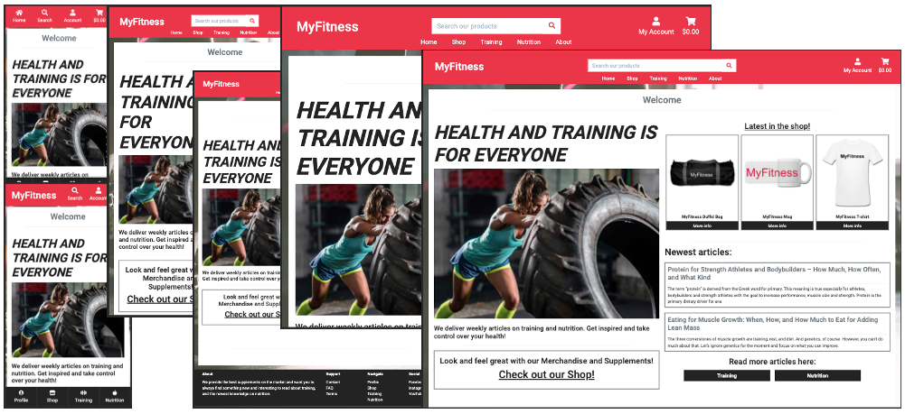

# Online Baking - Recipe Database

URL - https://meceder-myfitness.herokuapp.com/

MyFitness is a e-commerse store for nutrition supplements for people who work out. It is also a source for articles on what's new in training and nutrition. A place where you will hopefully find something interesting and learn, no matter what your previous experience in trainging is.

The project is hosted on [Github](https://github.com/matsceder/fsfmp-mec-myfitness/), deployed with [Heroku](https://www.heroku.com/), and [AWS](https://aws.amazon.com/) is used for cloud storage.

## UX
### Design, Mockups and Responsiveness

*From smallest screen top left to biggest screen on the right. Galaxy S5, Iphone8 Plus, Ipad, Ipad Pro, Laptop, Desktop screen.*

All image files for different devices are avaliable to see one by one in my [github repo](https://github.com/matsceder/fsfmp-mec-myfitness/tree/master/documentation).

Keeping it simple and making the site responsive to work great no matter what device you are using, the page changes a bit on scaling to always provide simple navigation and be as user friendly as possible. Using contrasts and only picking one color except from black and white, will hopefully make this page accessible for anyone.

### User Stories

This is meant to be just as much a platform to learn about training, just as it is an e-commerse store for sipplements and merchandise. Easy to access and work with as both a store owner or employee, and for a customer. There is also ideas about making it in to a social platform where you can keep track of your training. Here follows a list of user examples for the site as it is built right now.
- As a store owner or employee -
  - I want to easily add product objects to my store, so that customers can find and buy it.
  - I want to be able to edit or delete product objects in my store, so that we don't sell things with wrong information or something that is not in stock anymore.
  - I want to let customers contact us, so they can get answears to questions that will convince them to go through with a purchase.
  - I want to be able to create articles or programs, so our readers/followers can get access to it and hopefully feel like browsing into our shop and buy something afterwards.
  - I want to edit or delete those same articles, so that we can correct things that are wrong or not relevant anymore.
  - I want to be able to edit my own user profile, so that users can see who posted articles.
- As a customer -
  - I want to brows products in the shop, so that I can compare before I make a purchase.
  - I want to find out information about the products, so that I know what I'm getting.
  - I want to be able to create a user account, so that I can save my information for future purchases.
  - I want to edit my account details, so that I can add a new address if the old one is not relevant anymore.
  - I want to see my old order information, so that I can see what I got last time and buy it again.
  - I want to find articles on training, so that I can learn and get inspired to work out.
  - I want to find articles on nutrition, so that I can reach my goal weight and stay there.

#### Wireframes for the different devices:
The wireframes were built to get an idea of look and feel, and I was not sure exactly how my functionallity was gonna work out in the end. 
- [Mobile](https://www.figma.com/file/af4bugImT0Mx9fLuQnnTL5/My-Fitness?node-id=3%3A3)
- [Tablet](https://www.figma.com/file/af4bugImT0Mx9fLuQnnTL5/My-Fitness?node-id=3%3A0)
- [Desktop](https://www.figma.com/file/af4bugImT0Mx9fLuQnnTL5/My-Fitness?node-id=3%3A1)

## Features
This is a commecial platform and the idea is that it's meant to be able to make money from it. Giving away articles and programs is a feature to will bring people in and hopefully have them interested in our products for sale. With time the idea is to add subscription functionallity to get more content on a regular basis, though some content will always come out for free too. I also had the idea at first to be able to log your workouts and share with friends, and maybe even share motivational playlists using Spotiyfy's API or something similar.

### Existing features
- Products CRUD - Allows the admin, store owner or employee to create, read, edit or delete objects in the shop.
- Programs CRUD - Allows the admin, store owner or employee to create, read, edit or delete articles about Training or Nutrition.
- CKEditor - Letting the author of a program easily create a beautiful post with most functionallity you would have in a normal text editing program.
- User registration - Using Allauth to let customers create their own user accounts, verify their e-mail addresses, and retreive a lost password.
- Payment service - Using Stripe to handle payments effectivly in a safe manner.
- Order numbers - When a customer goes through the process of a purchase, an order number is automatically created and assigned to that order.
- Mail - Using G-Mail to handle order confirmations, letting the customer know the order was successfull and providing them their order numbers and summary.

### Planned features and improvements
- Subscriptions - Adding plans/services to subscribe to, to get more content and special deals.
- Social Platform - Make more out of the personal experience and be able to connect with people.
- Create Events - Set up a calendar event for you and a friend to meet and work out. Our invite people to train together.
- Logging training - Log and keep track of your training, and share it with your contacts.
- Playlists - Sharing your workout playlists to other people on the platform, using Spotify's API.
- Social Media - Connecting to social media and invite people to get started on taking control of their health.
- Commenting - For articles and programs, communicating and asking questions.
- Testing - More automated testing of the sites functionallity.

## Deployment
#### This page is deployed using [Heroku](https://www.heroku.com/) and [AWS](https://aws.amazon.com/) for cloud storage of media and static files. Following steps describes the process of deployment.
1. Create a repository on GitHub and connect it to your project. This might differ a little depenging on what code editor you're using.
2. Create your app using Django.
3. Login to your Heroku account and create a new app.
4. Go to "Resources"-tab and provision a new Postgres database for it.
5. In your termina, install dj_database_url and psycopg2-binary. After this make sure to freeze your requirements, using command "pip freeze > requirements.txt". This is so that Heroku will install all our app requirements when we deploy.
6. In settings.py, import dj_database_url.
7. Get your config variables from Heroku "settings", and in your settings.py file, replace your database settings and set defalt to dj_database_url.parse('your config var here').
8. Check migrations using "python3 manage.py showmigrations", if it's set up as expted none of your migrations will me marked off. Migrate those using "python3 manage.py migrate".
9. If you have any fixtures to build your database, you have to load them up now to. Using "python3 manage.py loaddata 'fixture-name'.json"
10. Create a new superuser so you'll have access to login. ("python3 manage.py createsuperuser")
11. The site shoud now be able to run with the new database settings.
12. Change it back to the initial database setting for now, to avoid database url ending up in version control and commit this to github. 
13. Set up your database url, refering to environment variables, but this time in an if statement, where it falls back on your default config if it fails.
14. In the terminal, install gunicorn to use as webserver. And then freeze it into requirements.txt.
15. Create a Procfile to comunicate to Heroku, explaining that we want to create a web dyno.
16. Login to Heroku in your terminal using "heroku login".
17. Disable collect static, either from your terminal or go to Heroku settings and add it as a config var.
18. Add your Heroku-app name unser allowed hosts, and also run your localsurver as second option.
19. Save this and commit changes to git. And after that initialize a Heroku repo and push to Heroku to deploy.
20. The app should now be live on Heroku but not have any static files.
21. In the Heroku app under "Deploy", connect the app to your GitHub repo so that it will automatically push to Heroku at the same time as you push to git.
22. Find a Django secret key generator and set it up in the environment varibales in Heroku, and then replace the old key in settings with the new key from the environment. Let's also turn of debug and set it to only be on if 'DEVELOPMENT' is a environment variable.
23. Deploy this and go to Heroku 'Activity' and you'll see that it's now building your app with the new input.
24. Now go to AWS, using the service called S3, create a new bucket with public access.
25. Turn on static website hosting undet the "Properties"-tab.
26. Go to permissions and set up CORS-configuration.
27. Set up a s3 bucket policy using the Policy-generator, including the ARN from the bucket policy page.
28. Copy that policy into the bucket, add /* to allow access to all resources, and save it.
29. Go to 'Access control list' and set 'Public access' to 'Everyone'-list objects.
30. Now look up the service "Iam" and create a user to access the S3 bucket we just created.
31. Seting up your user, create the policy used to access our bucket. Importing the managed prebuilt policy to access S3.
32. Look up your user and attach the policy to your user, giving it programatic access.
33. Download and save the CSV-file with the keys needed to access your files.
34. Install boto3 and django-storages in your terminal and freeze.
35. In settings add 'storages' under 'APPS', and then add all the information needed to access your bucket, using Heroku config variables to handle the passwords and other secrets.
36. Create 'custom_storages.py', import settings and S3BotoStorage, and create to classes that will inherit the storage locations form settings and tell it where want to store our static and media files. 
37. In settings, if AWS is being used, override the defaults for media and static storage.
38. Add, commit and push this to git and Heroku. When Heroku is done building your project, your static folders should be visible in your AWS bucket.
39. Create a new folder in your bucket, next to the static folder. And upload all your images to this folder, granting public read access.
40. Now your site should be fully deployed and all images and static files should be avalible for the templates to display in the correct way. If you want Stripe to work, you need to add some more settings handling the webhooks.

## Testing
Due to lack of time, I've chosen to not prioritize testing. I know I should have done it more thoroughly, but sometimes things don't go as planned. I'm not gonna blame anyone else but myself. Optimistic planning and bad priorities is the main cause for this. Turning in this project on the last day of my course that my student plan is avalable.

The testing I have done are the following.

- Manual testing
- Code refactoring
- Standardizing code
- Testing CRUD
- Integration tests
- Functional tests

### Manual testing
- Responsiveness - Using Chrome dev tools.
    - Mobile - Going through all templates making sure it does not break or look bad.
    - Tablet - Going through all templates making sure it does not break or look bad.
    - Desktop - Going through all templates making sure it does not break or look bad.
    - Browsers first test - Comparing browsers, opening the page in Chrome, Firefox and Safari.
- Navigation
    - All links work and take you to the correct pages. Nothing breaks, and when you go to social media it opens up in new tabs.
- Database
    - Filtering the database, both in products and in programs works great.
### Refactoring and Standardizing code.
- HTML and CSS
    - Using WebFormatter, making sure all code is well indented and easy to read, with comments telling you what the section of code is about.
    - Running all templates through W3C Markup Validation service. Everyhing looks good.
    - Running website testing on PowerMapper. Some errors, but all that I'm ok with, being thrown from allauth, or because of Django template tags that makes it look weird even though it works fine.
- Python3
    - Styled according to PEP 8 guide lines, trying to add clear and logic comments to different sections.

### Testing CRUD
Testing all functionallity for admin/employee CRUD of both products and programs
- Create - 
    - Products, Brands and Producers tested and working fine.
    - Programs tested and works really well. CKEditor is easy to work with.
- Read - 
    - Products are easily filtered, accessed and read.
    - Programs display nicely with a snippet at the overview, and with pictures and everything looking good in the detailed view.
- Update - 
    - Products, if logged in and authorized, the user gets the option to edit, and it works good, without any interuptions.
    - Programs, are easily edited, by the specific author or the admin.
- Delete -
    - Products, if logged in and authorized, the user gets the option to delee an object, with a modal prompt asking if you're really sure of this. 
    - Programs, can only be deleted by author or admin. Works as intended.

### Integration Tests
Just creating a few tests in the Products app to show that I know what it's about, and try to show off some good intentions at least.
- Running tests of URLs - To make sure it keeps returning the correct views.
- Running tests of Views - To see that we get the correctly returned respons.
- Running tests on Models - To see that we get returned what we ask for after creating a new object and calling a connected function.
### Functional Tests
- Running tests on Forms - To check make sure form is valid.

## Credits
### Technologies and sources used

- [HTML](https://developer.mozilla.org/en-US/docs/Web/HTML) - Basic structure is built using simple HTML
- [CSS](https://developer.mozilla.org/en-US/docs/Web/CSS) - Is used for styling
- [Python3](https://www.python.org/) - Connecting database with user
- [Django](https://www.djangoproject.com/) - Framework to build apps and access templates
- [JQuery](https://jquery.com) - Simplifying DOM manipulation.
- [GitHub](https://github.com/) - Hosting repository
- [GitPod Workspaces](ttps://www.gitpod.io/) - Real time development in browser
- [Google Chrome](https://www.google.com/chrome/) - Using Dev tools, manual testing while developing
- [Google](https://www.google.com/) - Research and troubleshooting
- [Google Fonts](https://fonts.google.com/) - Library for all fonts in the app
- [Font Awesome](https://fontawesome.com/) - Used to complement icon library
- [W3C Markup Validation Service](https://validator.w3.org/) - Validation of HTML and CSS
- [Heroku](https://www.heroku.com/) - Deployment of app
- [AWS](https://aws.amazon.com/) - Cloud hosting for media and static files
- [SchemeColor](https://www.schemecolor.com/sneaky-peaky.php) - Color theme
- [Figma](https://www.figma.com/) - Making of wireframes / mockups
- [WebFormatter](https://webformatter.com/html) - Formatting code
- [PowerMapper](https://www.powermapper.com) - Website testing
- [YouTube](https://www.youtube.com/) - For reseatch and tutorials
- [Excel](https://www.microsoft.com/en-us/microsoft-365/excel) - Making my own csv-files with data
- [ConvertCSV](https://www.convertcsv.com/csv-to-json.htm) - Creating my own JSON-fixtures
- [The Dumbfounds](https://www.youtube.com/watch?v=qwypH3YvMKc&t=5s) - Testing Django tutorial

### Content
- [Tyngre](https://tyngre.se/) - Inspiration for both business plan and visual presentation. The about us section taken form here.
- [Gymgrossisten](https://www.gymgrossisten.com/) - Inspiration for e-commerse store and where I borrowed all images of products, ingredients and description for my database.
- [Styrkelabbet](https://www.styrkelabbet.se/) - Inspiration for visual aspect and where I got my articles for my programs on training and nutrition.
- [JustDjango](https://www.youtube.com/watch?v=HWg3zXWwre8) - Tutorial on how to get started with CKEditor
- [CSS-Tricks](https://css-tricks.com/snippets/css/transparent-background-images/) - How to get a nice static background with content that flows on top.
- [Unsplash](https://unsplash.com/) - For stock photos.
- [Holland and Barrett](https://www.hollandandbarrett.com/info/terms-and-conditions/) - Terms and Conditions taken from here and then modified.
- [BodyBuilding](https://www.bodybuilding.com/fun/about.html) - 'Core Values' taken from here and modified.

### Acknowledgements
- Seun Owonikoko @seun_mentor - My mentor at Code Institute
- Code Institute channel on Slack - For motivation and a helping hand
